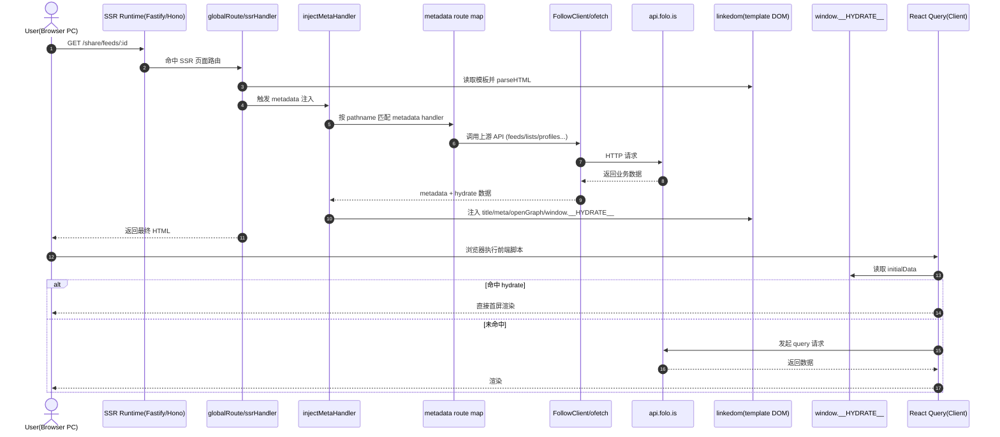
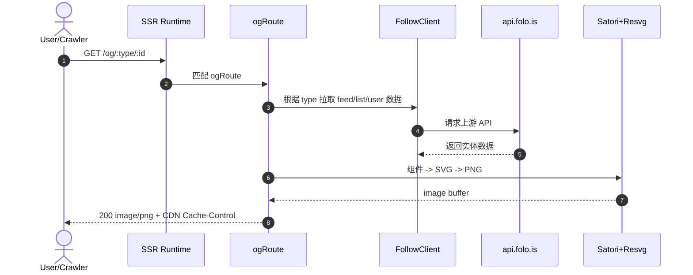
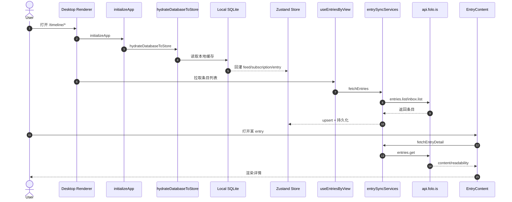

# Folo SSR 架构与时序说明

## 1. 框架栈总览

### 1.1 服务端运行时

- Node Runtime: Fastify + `@fastify/request-context` + `@fastify/middie`
  - 入口：`apps/ssr/index.ts`
  - 路由挂载：`ogRoute(app)` + `globalRoute(app)`
- Edge Runtime: Cloudflare Workers + Hono
  - 入口：`apps/ssr/worker-entry.ts`
  - 路由同样覆盖 OG/Share/Auth 页面
  - 通过 `wrangler.jsonc` 绑定静态资源与 R2 字体桶

### 1.2 客户端（SSR 前端壳）

- React 19 + React Router 7
- Vite 构建，`vite-plugin-route-builder` 从 `client/pages` 生成路由
- TanStack Query 作为数据获取层
- Jotai 维护轻量全局状态

### 1.3 数据与 API 访问

- `@follow-app/client-sdk` 作为统一 API SDK
- SSR 服务端调用上游 API 使用：
  - `createFollowClient()`（SDK）
  - `createApiFetch()`（ofetch）
- 客户端页面调用上游 API 使用：
  - `client/lib/api-fetch.ts` 中的 `followClient`

### 1.4 OG 图片渲染栈

- Satori（React 节点转 SVG）
- Resvg（SVG 转 PNG）
- Node 环境使用 `@resvg/resvg-js`
- Worker 环境使用 wasm shim

---

## 2. 系统架构

### 2.1 高层分层

1. 请求入口层（Fastify/Hono）
2. 路由分发层（OG 路由、Global SSR 路由、Redirect）
3. 元数据注入层（`injectMetaHandler` + metadata map）
4. 上游 API 访问层（Follow SDK/ofetch）
5. HTML 注入层（meta/title/hydrate/env）
6. 浏览器 CSR 层（Router + React Query，优先消费 `window.__HYDRATE__`）

### 2.2 关键目录职责

- `apps/ssr/src/router/*`
  - `global.ts`: HTML 模板渲染与 metadata 注入
  - `og/*`: OG 图片接口
- `apps/ssr/src/meta-handler.ts`
  - URL 匹配 metadata handler
- `apps/ssr/client/pages/*`
  - 页面与 metadata 定义（`metadata.ts`）
- `apps/ssr/client/query/*`
  - 客户端 query hooks（支持 initialData hydrate）
- `apps/ssr/src/lib/api-client.ts`
  - SSR 访问上游 API 的客户端构建与请求头注入

### 2.3 Node 与 Worker 差异

- Node（Fastify）偏本地开发与传统 SSR 服务部署
- Worker（Hono）用于 Cloudflare 生产/边缘部署
- 二者都复用 metadata 注入与 OG 渲染逻辑，保持行为一致

---

## 3. 对外接口清单（apps/ssr 暴露）

## 3.1 OG 接口

- `GET /og/feed/:id`
- `GET /og/list/:id`
- `GET /og/user/:id`

用途：为分享卡片提供动态 OpenGraph 图片。

### 3.2 分享页与认证页 SSR 接口

- `GET /share/feeds/:id`
- `GET /share/lists/:id`
- `GET /share/users/:id`
- `GET /login`
- `GET /register`
- `GET /forget-password`
- `GET /reset-password`

用途：返回注入了 SEO metadata 与 hydrate 数据的 HTML。

### 3.3 Redirect 接口（Worker）

- `GET /feed/:id -> /share/feeds/:id`
- `GET /list/:id -> /share/lists/:id`
- `GET /profile/* -> /share/users/*`

### 3.4 其它

- `GET /healthz`（`worker-app.ts` Fastify 版本中的健康检查）
- `GET *`（Worker SPA fallback，返回静态 index.html 并注入 env）

---

## 4. 核心流程时序图（PC 到最底层）

## 4.1 分享页 SSR 主链路（推荐主读）

## 4.2 OG 图片接口链路

## 4.3 PC 主应用（`/timeline`）数据主链路（对照）

---

## 5. 接口逐条流程详解

## 5.1 `GET /share/feeds/:id`

1. `globalRoute` 接收请求，创建模板 DOM
2. `injectMetaHandler` 根据 path 匹配 `share/feeds/[id]/metadata.ts`
3. metadata 中调用 `apiClient.api.feeds.get({ id })`
4. 返回 `openGraph + title + hydrate + apple-itunes-app`
5. 注入 HTML 后返回
6. 客户端 `useFeed()` 从 hydrate key `feeds.$get,query:id=${id}` 读取 initialData

## 5.2 `GET /share/lists/:id`

1. 匹配 `share/lists/[id]/metadata.ts`
2. 调用 `apiClient.api.lists.get({ listId })`
3. 注入 OG/title/hydrate
4. 客户端 `useList()` 使用 hydrate key `lists.$get,query:listId=${id}`

## 5.3 `GET /share/users/:id`

1. 匹配 `share/users/[id]/metadata.ts`
2. 先 `profiles.getProfile({ id/handle })`
3. 并行尝试 `subscriptions.get({ userId })` + `lists.list({ userId })`
4. 按成功结果注入多段 hydrate（profile、subscriptions、lists）
5. 客户端页面分别消费三个 query 的 initialData

## 5.4 `GET /login`

1. 匹配 `login/metadata.ts`
2. 服务器请求 `/better-auth/get-providers`
3. 注入 `betterAuth` hydrate
4. 客户端 `useAuthProviders()` 直接使用该 hydrate，减少首屏请求

## 5.5 `GET /og/:type/:id`

1. `ogRoute` 解析 `type`
2. 对应调用 `renderFeedOG/renderListOG/renderUserOG`
3. 渲染函数内部先请求上游 API 获取实体数据
4. 用 Satori + Resvg 生成 PNG
5. 返回图片流并附带缓存头

---

## 6. 最底层组件与职责

- 本地模板/注入层：`linkedom + html-minifier-terser`
- 元数据路由器：`meta-handler.ts + meta-handler.map.ts`
- 上游访问层：`FollowClient/ofetch`
- 图片渲染引擎：`Satori + Resvg(js/wasm)`
- 客户端消费层：`React Router + React Query + window.__HYDRATE__`

---

## 7. 关键源码索引

- Node SSR 入口：`apps/ssr/index.ts`
- Worker 入口：`apps/ssr/worker-entry.ts`
- 全局 SSR 路由：`apps/ssr/src/router/global.ts`
- OG 路由：`apps/ssr/src/router/og/index.ts`
- Metadata 注入器：`apps/ssr/src/meta-handler.ts`
- Metadata 映射：`apps/ssr/src/meta-handler.map.ts`
- Feed metadata：`apps/ssr/client/pages/(main)/share/feeds/[id]/metadata.ts`
- List metadata：`apps/ssr/client/pages/(main)/share/lists/[id]/metadata.ts`
- User metadata：`apps/ssr/client/pages/(main)/share/users/[id]/metadata.ts`
- Login metadata：`apps/ssr/client/pages/(login)/login/metadata.ts`
- 客户端 API：`apps/ssr/client/lib/api-fetch.ts`
- 服务端 API：`apps/ssr/src/lib/api-client.ts`
